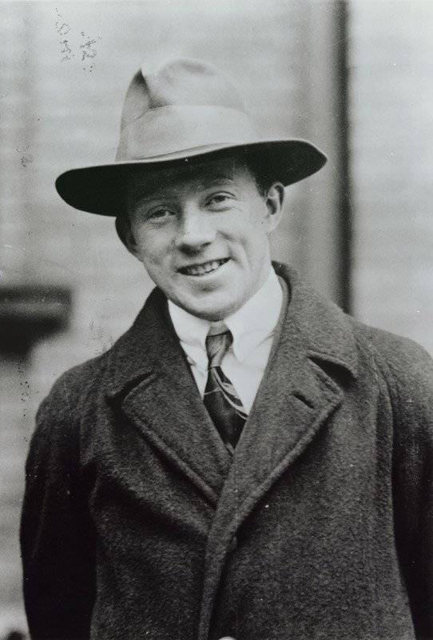
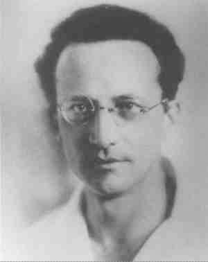
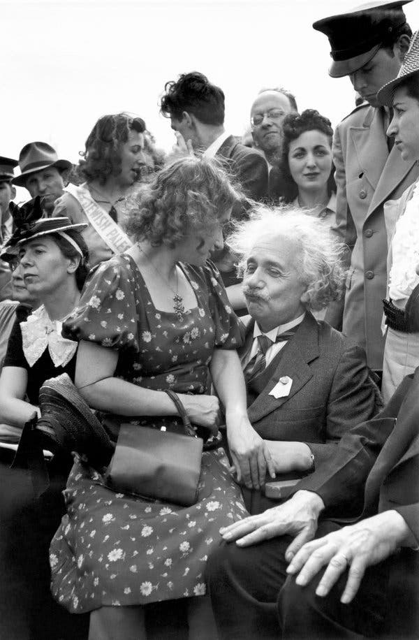
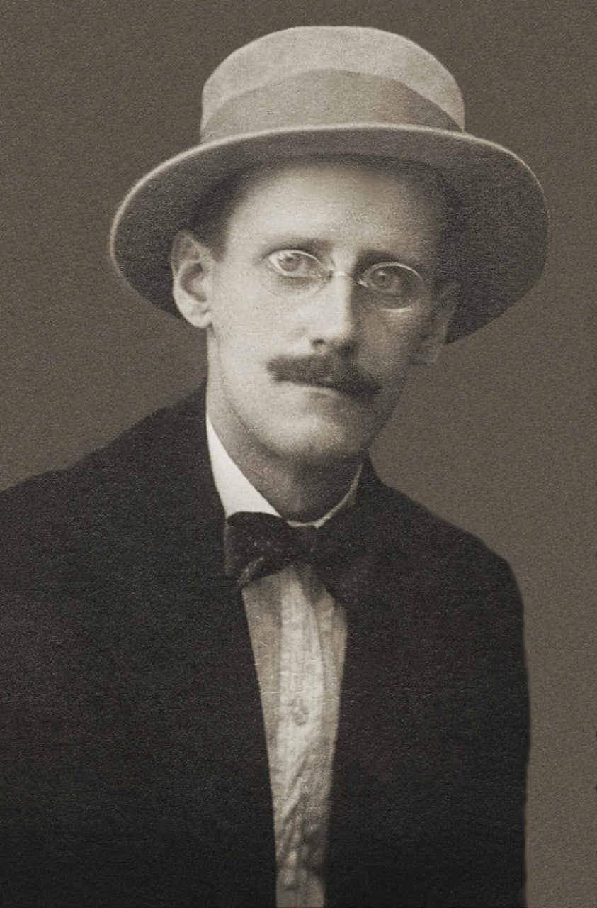

## Темы, которые путают (2):

# Волновая функция. История вина и фейла. (Фейл победил.)

Когда только открыли квантовую механику сразу начался тупёж за континуальность, типо всё непрерывно и гладко должно быть, а оно скачет. Тупили бы и тупили, но нет, нашлись два чудака.

Гейзенберг. Типо накурился, идёт себе по аллее, прогуливается после жаркого трудового дня, уже и Солнце село, фонари зажгли, а ему хоть бы хны, гуляет и гуляет. А тут за ним типок увязался. Гейзенберг и высадился, вдрук мент, а на кармане ещё курить и курить. Ничё, справился, отошёл в сторонку, спрятался, наблюдает. А там хрень какая-то: типок, то под фонарём появится, то в тени пропадёт. Вот тут Гейзенберга и накрыло по-настоящему, он всё за кванты понял (типо они себя ведут также, только пропадают в натуре), домой прибежал, за стол сел и накидал матрицу распределения. Утром коллегам хвастается, гля какой я умный. А они ему, а умные сегодня по столовой дежурят. Ну, что делать, поплёлся в столовую чашки для профессуры расставлять. Это был вин. Матрица-то осталась.

Шрёдингер. Как-то раз друзья ботаники из Нидерландов прислали гибрид на пробу, типо индика-сатива, а вот с процентным соотношением затрудняемся. Ну, друзья-коллеги-учёные надо помочь. Кароче, помогал, помогал, в итоге так накурился, что понял всё. Сразу надо записать, это ещё со студенчества навык. Писал, писал, всю ночь писал, в итоге какая-то хрень получилась. Хрень, но очень симпатишная, если здесь отрубить, здесь сократить, это вообще нафиг убрать, то вполне себе нормально, чётко, свежо и лаконично. Принёс на работу, ему сразу премию и отпуск. Это был фейл. 

Потому что, когда он вернулся из отпуска, его уравнение было прибито к научной доске четырьмя пятидюймовыми железными гвоздями, все ему улыбались и если не жали руку, то старались хотя бы погладить. Так как, с этой матрицей Гейзенберга была полная засада. Она может и точно отображает суть происходящего, но решается чертовски сложно. Уравнение Шрёдингера тоже не подарок, но хотя бы аспирантов уже на ночь запирать перестали, что способствовало резкому поднятию духа и всеобщему оживлению.

Шрёдингер, конечно, вы чё с ума тут все посходили, какая нах волна, вон Эйнштейну уже нобеля за кванты вручили. Побойтесь Бога. А ему, старик, пока ты отпуске был, парадигма изменилась. С фотонами всё правильно, мы же не нобелевский комитет, но есть ньюанс, пока на квант не смотришь - он волна. Врубись как клёво, коллега, посмотрел - частица, не смотришь - волна, и всё сходится. И эту долбанную матрицу разтакогото долбанного Гейзенберга по ночам решать не надо. А тут ещё Нильсу, нашему, Бору посылку с волшебными грибами мексиканский президент в качестве гранта подогнал. Ты только попробуй и сам тут же во всё врубишься.

Шрёдингер только рукой махнул и пошёл сразу к Эйнштейну. Ты, говорит, как лев науки, нобелевский лауреат и почти старый еврей, что скажешь? А Эйнштейн сам чуть не плачет, они, говорит, теорию относительности ни в грош не ставят, "коллапс" волновой функции, говорят. Я им говорю, ребята, вы вообще волну видели, она же расходится и затухает, как она коллапсирует, мгновенно чтоле? Да, говорят, есть такая тема. Я такой, чё теперь в школе теорию относительности не преподают? Нет, говорят, там другая тема, никто не понимает, "заткнись и считай", блять говорят. Блять, я устал уже считать, я это грёбанное e=mc² блять пять раз выводил. Каждый раз, блять, с ошибкой. Можно уже не считать? Я лев или кто. Светило науки, должность есть такая, слышал? Здесь норм, здесь хуйня, вот и вся работа. Про волну хуйня. Даже не заморачивайся. 

Шрёдингер тогда ничего не сказал, достал из-за пазухи бутылку ядрённого австрийского шнапса и молча выпил. Эйнштейну тоже налил. Там к ним ещё и Джойс припёрся, но это уже совсем другая история.

За матрицы Гейзенберга тогда никто и не вспомнил. Да и с Джойсом вообще за физику не поговоришь. Поток сознания наше всё, ну и понеслось. Никто тогда не пошёл Бору морду бить. Пошли все к джойсовским проституткам и все франки там и оставили. Метро ночью не ходит. Да, к чёрту этого Бора, я уже отрубаюсь ребята.

Так и живём чо, в шизофреничном мире где квант это и волна и частица. В зависимости от того смотришь на него или нет. А могли бы жить в матрице. Так фейл победил.

Продолжение следует.

#qm_tales