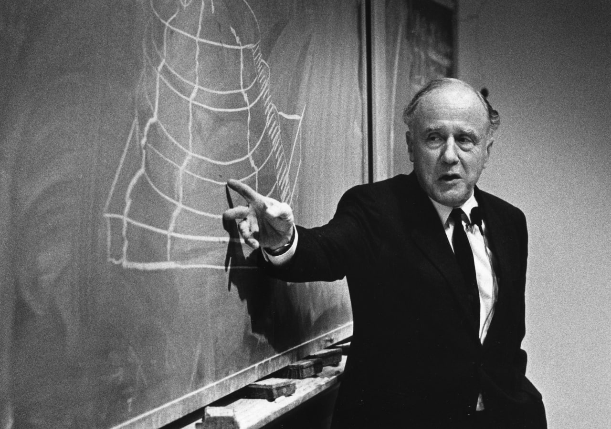
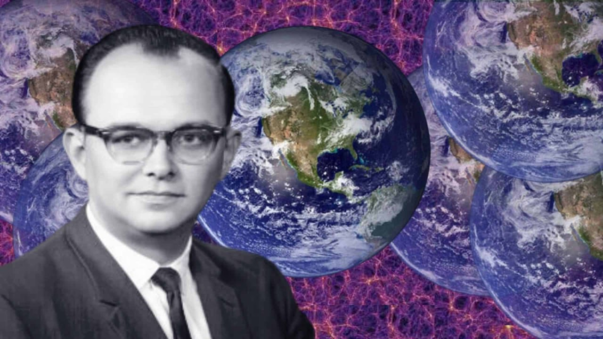
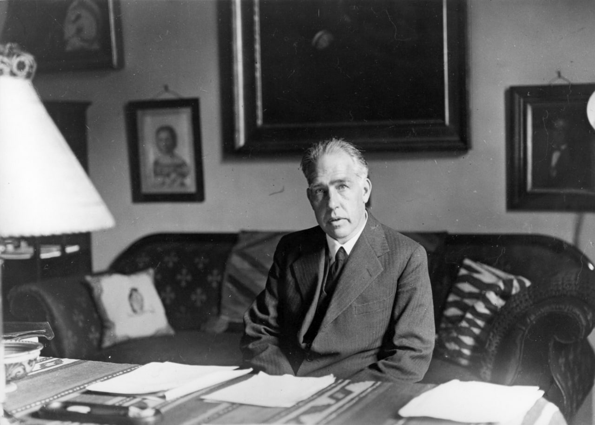

# Волновая функция. История вина и фейла (продолжение).

Слава Богу, в том институте тётки уборщицы не особо парились, они больше по аспирантам, да по учёным впирались. Умным типо клёво быть. Гранты, путешествия, все дела. А грибов с Мексики реально много пришло. Ну и не то, чтобы разбрасывались, но относились крайне пренебрежительно, никто ни за кем не доедал. Не чувак, спасибо, сча коронавирус свирепствует, ты извини, я новую порцию просто открою. Вообщем, грибов особо никто не считал и валялись они где попало. А уборщицы.. ну понятно, по углам, как всякая хрень валялась, так и будет валяться до скончания веков, никакой робот-пылесос не справится. А уж в научный холодильник никакая уборщица точно не заглядывала.

А тут Джон Арчибаль Уилер. Профессор из США. Чёрная дыра, квантовая пена, it from bit, это всё от него. Кароче новая школа. ЛСД, телевизор, ядерная бомба. А сам Уилер - светило науки и всей физики. Он тоже туда заехал и грибов тех захватил и накормил ими своего ученика Хью Эверетта III и рассказал ему всю эту поганую историю. Эверетт так пропёрся, что вскричал: хуй волне! Уилер говорит, это все так говорят, а ты докажи. Эверетт, молодой задорный, не стал спорить, вырубил себе ещё грибов, приехал домой, заперся, закинулся грибами и крепко взмедитнул.

Что ему там виделось ни словами не описать, ни руками не потрогать, ни глазами не увидеть. Слава Богу есть чёткие математические уравнения, которые, походу, могут выразить всё, что угодно. Кароче Эверетт с утра, трезвый как стёклышко: господин профессор почётный член-корреспондент королевских академий Джон Арчибаль Уилер, аспирант Хью Эверетт III докладывает: проблема решена - "коллапс" не нужен. И протягивает смятый листок бумаги, со следами вчерашней бурной ночи.

Уилер брезгливо разворачивает листок, а там современное модифицированное уравнение Шрёдингера уже включающее в себя коллапс функции и часть про коллапс вычеркнута чьей-то дрожащей рукой.

Уилер внимательно разглядывает уравнение, что-то хмыкает, бормочет, улыбается. Да, говорит, норм. Так сойдёт. Пишите диссер, я подпишу. А лично от меня - я вам устрою встречу с Бором. Если и он подпишет - это сразу нобель. Идите уже, не томите.

Эверетт сразу к Бору, нобель решает же. Бор его берёт под руку и говорит, а давайте, голубчик, пройдёмся, я вам Копенгаген покажу, а мне как старику свежий морской воздух очень полезен, все врачи рекомендуют.

Ну и давай ему за всю свою нелёгкую тереть, иногда прерываясь. А вот, обратите внимание на это место. Здесь я в первый раз с Эйнштейном подрался. Ох, ну и всыпал я же ему! А вот здесь они меня с Джойсом подкараулили, ох ну и досталось же мне. Эх, молодость, молодость. Мне Айнштайн этот ваш все уши про свою теорию прожужал. Все лучшие годы, всю молодость ей отдал. Революцию не поехал в Россию делать. Сидел в патентном бюро уравнения решал. Люди новый дивный мир, Бор, мне говорит, строят, а я как проклятый пишу и пишу. Хоть нобеля дали, правда не за то и не за это.

Эверетт как за Эйнштейна услышал, сразу подтянулся, выпрямился. Да, говорит, господин уважаемый член почётных академий... Ох, Бор, его прерывает, давайте уже без формальностей, мы же с вами не в научном совете. Есть, сэр, справляется с собой Эверетт. Энштейн мой кумир, сэр, я ему столько писем написал, сэр, он мне даже на одно ответил. Я потом твёрдо решил стать учёным, сэр. Я, сэр, в прилагаемой диссертации, как и заповедовал наш великий дедушка Айнштайн - отсёк всё невозможное и оставил только возможное, каким бы абсурдным оно не казалась. Превозмог довлеющий над нами интуитивизм, сэр, если можно так сказать, сэр.

Так то оно так, голубчик вы мой дорогой, но вот Эйнштейн за 1905 only жаловался, революцию типо проспал. А я всю свою жизнь на копенгагенскую интерпретацию положил и до сих пор кладу. Мне ваше многомирие не очень по душе, как на духу вам скажу. Эйнштейн, тот да, может и возрадовался бы, а может и нет. Штайнер не зашёл же, например. А давайте в Христанию заглянем, очень любопытный квартал, к тому же сегодня судно с марокканскими апельсинами пришло. А у них очень недурственный гашиш, надо вам сказать.

Вообщем, вернулся Эверетт из Европы ни с чем (ну, кроме гашиша, который и впрям недурственным оказался).

#qm_tales